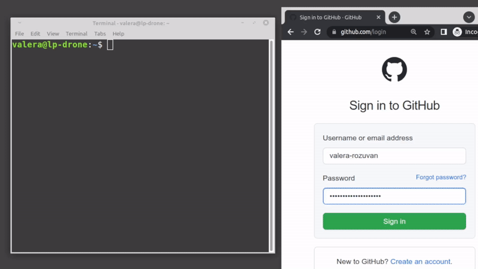
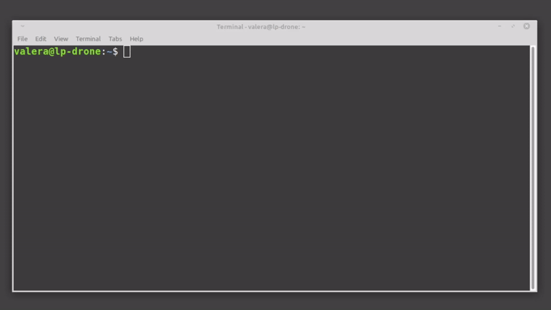

# gen2fa

generate 2FA codes helper utility



## About

We want to use [pass](https://www.passwordstore.org/) to securely store 2FA secrets, and [onetimepass](https://pypi.org/project/onetimepass/) to generate the 2FA codes. We want a nice Bash script to tie the two together. This will:

- allow for automation
- provide a fast workflow for generating 2FA codes for any service which requires 2FA

## Rationale

Why did I create the `gen2fa` helper utility? Because pulling out my mobile phone every time I needed a 2FA code got deeply frustrating. Also, because I needed to automate some CI workflows, which required manual intervention by the operator (inserting a 2FA code generated by a mobile phone).

## Requirements

- [pass](https://www.passwordstore.org/)
- [Python](https://www.python.org/) v3.3+
- [Bash](https://www.gnu.org/software/bash/)
- [grep](https://www.gnu.org/software/grep/)
- [xclip](https://github.com/astrand/xclip)
- [sed](https://www.gnu.org/software/sed/)

The Python module [onetimepass](https://pypi.org/project/onetimepass/) is provided in this source tree. This is because we need [a fix](https://github.com/tadeck/onetimepass/pull/22), which has not been merged into the original project for a long time (still the case as of `08.01.2024`).

## How this works

Fundamentally, you need two things. First, is an entry in pass called `two_fa`. For example, running:

```shell
$ pass two_fa
```

should produce:

```text
acc1: provider1/user_name
acc2 name: provider2/other_username
acc3: provider3
```

`gen2fa` utility will parse this output and will interpret everything up to the semicolon (`:`) as the account name. What comes after, is the pass entry for that account. It should contain the 2FA secret.

Second, you need 2FA secrets stored in pass under each account entry. For example, running:

```shell
$ pass provider2/other_username
```

should produce:

```text
... some stuff
2FA secret: UDHFJH6756HJGKJF786KJGFDGH675KHGHG
... some more stuff
```

`gen2fa` utility will parse this output, and will extract the 2FA secret from the line that starts with `2FA secret: `.

## Usage

For the standard case when you just need to get a 2FA code, and login to some website:

```shell
$ gen2fa -c
Enter the account to generate 2FA: acc2 name

2FA code '123456' was copied to clipboard. Will clear in 6 seconds...
```

If you need to get a 2FA code as part of some automation script, you can use:

```shell
$ TWO_FA_CODE=$(gen2fa -q <<< "acc2 name")
$ echo $TWO_FA_CODE
123456
```



NOTE: If, for automation purposes, you want to skip GnuPG asking for a passphrase - you can setup GnuPG to keep credentials cached for a really long time. You just enter the passphrase one time, and forget about it. See `default-cache-ttl` and `max-cache-ttl` configuration options in [GnuPG docs](https://www.gnupg.org/documentation/manuals/gnupg/Agent-Options.html). Set both `ttl` options to a year or so (say, 34560000 seconds, which is around 400 days), and you should be fine.

## Optional arguments

Available CLI arguments, understood by the script:

```text
  -l | --list       List available accounts to generate 2FA for.
  -c | --clipboard  Copy the 2FA code to clipboard using xclip.
  -q | --quiet      Try to be less verbose.
  -d | --debug      Print extra debugging information - contents of the script variables.
  -h | --help       Print help information; CLI usage.
       --version    Print version.
```

## Useful alias

To be able to run `gen2fa` using just the script name, you can add an alias to your `.bashrc`:

```shell
alias gen2fa="/home/user/path/to/project/gen2fa/gen2fa.sh"
```

Reload your `.bashrc` (one way is to close & open your terminal). Then you can do:

```shell
$ gen2fa --version
gen2fa v1.1
```

## Security implications

Some thoughts on security behind 2FA, and the approach taken by the `gen2fa` utility.

When you enable 2FA on some site (or for some service), you will use something like [Google Authenticator](https://en.wikipedia.org/wiki/Google_Authenticator) to scan a bar code, and then enter a newly generated 2FA code to proceed. Most likely the site (or service) will also give you several 2FA backup codes to be used in case of emergencies. Some scenarios when you would need the 2FA backup codes:

- you lost the phone with the authenticator app
- the phone got damaged (can't repair)

In an ideal world, you will print the backup codes on paper, and stash the paper in a safe place. If you lose your 2FA device, you have 2FA backup codes on paper, and can recover access to your account.

The safest way to protect your accounts is to store the different kinds of login credentials separately. Passwords should be stored in one secure place, 2FA secrets (along with ability to generate 2FA codes) in another secure place, and 2FA backup codes in a third secure place. This way, even if one of the secret storage places gets compromised, the attacker has only partial login credentials, and can't access your account.

In a less ideal world, what happens most of the time, you save everything (including the 2FA backup codes) in some password manager. The author of `gen2fa` is using [pass](https://www.passwordstore.org/) to store the 2FA backup codes. When using pass, everything is encrypted using your private [GPG](https://gnupg.org/) key. If the pass store is compromised, then the backup codes are revealed, and the adversary receives access to your accounts. However, if you follow sane security guidelines, it is very unlikely that someone will compromise your pass store. First, your GPG private key has to be compromised. Second, your pass store has to be compromised.

In any case, if you are already storing everything in a pass store, storing the 2FA secret along does not weaken the security of your accounts.

NOTE! For highly critical production systems, care needs to be taken when dealing with security matters. In such cases, the author of `gen2fa` recommends storing different types of login credentials separately. Therefore, the author of `gen2fa` does not advocate the use of `gen2fa` for critical production system accounts.

---

## license

The project `'gen2fa'` is licensed under the MIT License.

See [LICENSE](./LICENSE) for more details.

The latest source code can be retrieved from one of several mirrors:

1. [github.com/valera-rozuvan/gen2fa](https://github.com/valera-rozuvan/gen2fa)

2. [gitlab.com/valera-rozuvan/gen2fa](https://gitlab.com/valera-rozuvan/gen2fa)

3. [git.rozuvan.net/gen2fa](https://git.rozuvan.net/gen2fa)

Copyright (c) 2022 [Valera Rozuvan](https://valera.rozuvan.net/)
